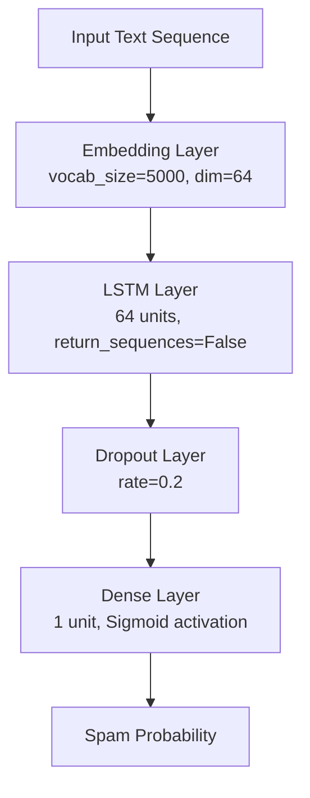

# Model Development & Architecture

This folder contains the neural network model design, training code, and saved model weights for the **Intelligent SMS Spam Detection** system.

## 🧠 Model Architecture

The model is built using TensorFlow and Keras, employing a Recurrent Neural Network (RNN) with Long Short-Term Memory (LSTM) units. The network is structured sequentially to process text inputs and output binary classification probabilities (Ham vs. Spam).



### Layer Details

1. **Embedding Layer**:
   - **Purpose**: Converts integer-encoded word tokens into dense vectors of fixed size, mapping words with semantic similarity closer to each other.
   - **Parameters**:
     - `input_dim` (Vocabulary Size): `5,000` (represents the top 5,000 most frequent words in the corpus).
     - `output_dim` (Embedding Dimension): `64` (dense vector representation size).
     - `input_length` (Sequence Length): `100` (input sequence length after padding/truncating).
     - `mask_zero`: `True` (forces downstream LSTM to ignore padded `0` tokens, improving efficiency and accuracy).

2. **LSTM Layer (Long Short-Term Memory)**:
   - **Purpose**: Captures sequential dependencies, contextual meaning, and long-term relationships between words while solving the vanishing gradient problem.
   - **Parameters**:
     - `units`: `64` (size of the cell state and hidden state vectors).
     - `return_sequences`: `False` (returns only the final hidden state to feed into the dense classifier).

3. **Dropout Layer**:
   - **Purpose**: A regularization layer to prevent overfitting by randomly setting a fraction (`20%`) of output units to zero at each update step during training.
   - **Parameters**:
     - `rate`: `0.2`

4. **Dense Layer (Output)**:
   - **Purpose**: Map the 64-dimensional LSTM outputs to a single probability score.
   - **Parameters**:
     - `units`: `1`
     - `activation`: `'sigmoid'` (maps output to the range $[0, 1]$, representing the spam probability).

---

## 🛠️ Hyperparameters & Compilation Settings

- **Optimizer**: `Adam` (adaptive learning rate optimization algorithm).
- **Loss Function**: `binary_crossentropy` (standard loss function for binary classification tasks).
- **Training Metrics**: `accuracy`
- **Batch Size**: `64`
- **Epochs**: `10`

---

## 📂 Files in this Directory

- [train_lstm.py](file:///Users/binurijinendraweerasinghe/Documents/sms-spam-detection/models/train_lstm.py): Main script to train the model, evaluate performance, print metrics (Accuracy, Precision, Recall, F1-Score, Confusion Matrix), and save output files.
- `spam_model.h5`: Saved trained weights and architecture of the LSTM model in the legacy HDF5 format.
- `lstm_model.keras` & `simple_rnn_model.keras`: Existing alternative/reference trained model formats.

---

## 🚀 How to Train and Evaluate

Ensure the Python environment is set up and activated:
```bash
# Set up the virtual environment (if not already done)
./setup_env.sh

# Activate the virtual environment
source venv/bin/activate

# Train the LSTM model
python3 models/train_lstm.py
```
After training, the model is serialized to `models/spam_model.h5`, and training history metrics are saved under `results/lstm_history.json` for Member 3's evaluation.
