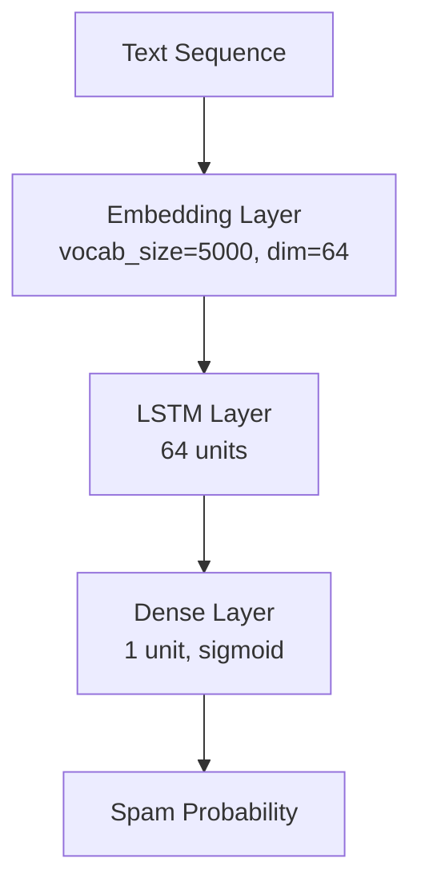

# Model Development & Architecture

This folder contains the LSTM-based model design and training workflow for the SMS spam detector.

## Architecture
The model uses a Keras Sequential stack:



### Layer details
- Embedding layer: maps token ids to dense vectors of size 64.
- LSTM layer: learns sequence dependencies in the text.
- Dense layer: outputs a binary spam probability.

## Training configuration
- Optimizer: Adam
- Loss: binary_crossentropy
- Metrics: accuracy
- Batch size: 64
- Epochs: 5

## Output files
- [models/spam_model.h5](models/spam_model.h5) — trained LSTM model
- [models/spam_model.keras](models/spam_model.keras) — Keras-format copy
- [results/spam_model_history.json](results/spam_model_history.json) — training history

## Training command
```bash
python src/models/train.py
```
