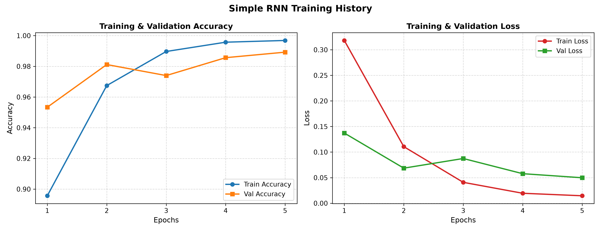
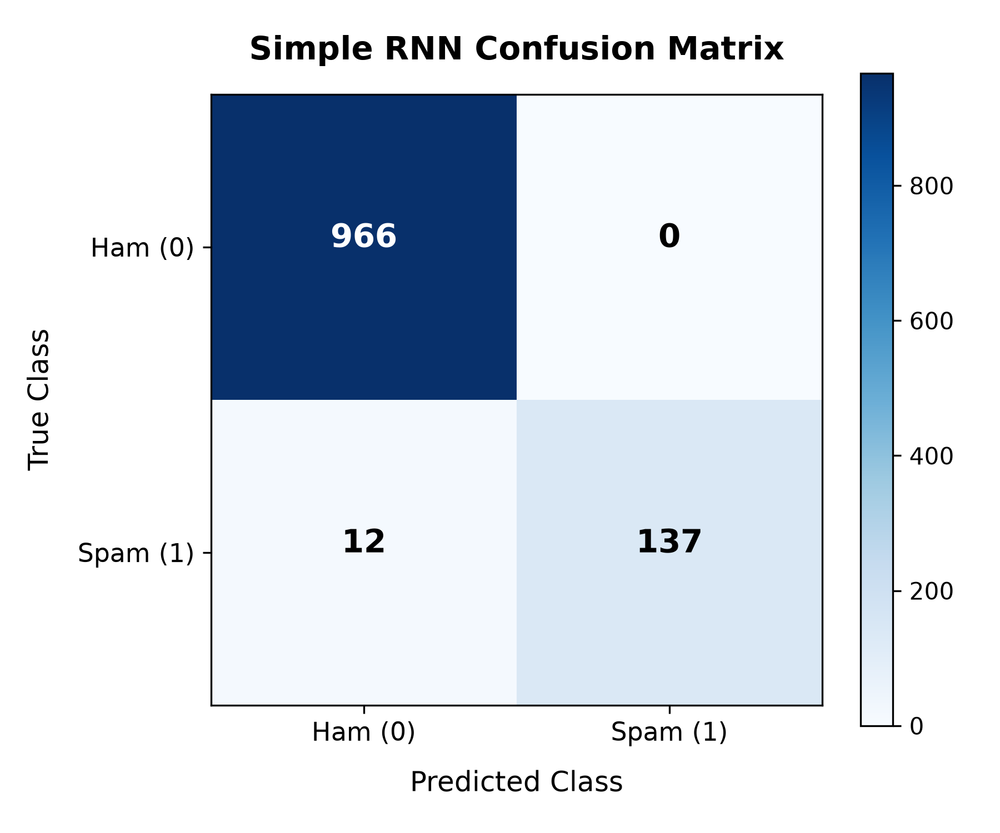
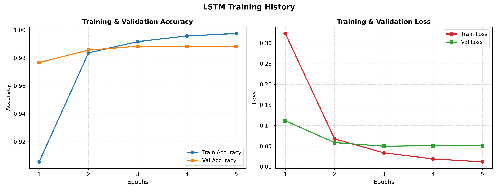
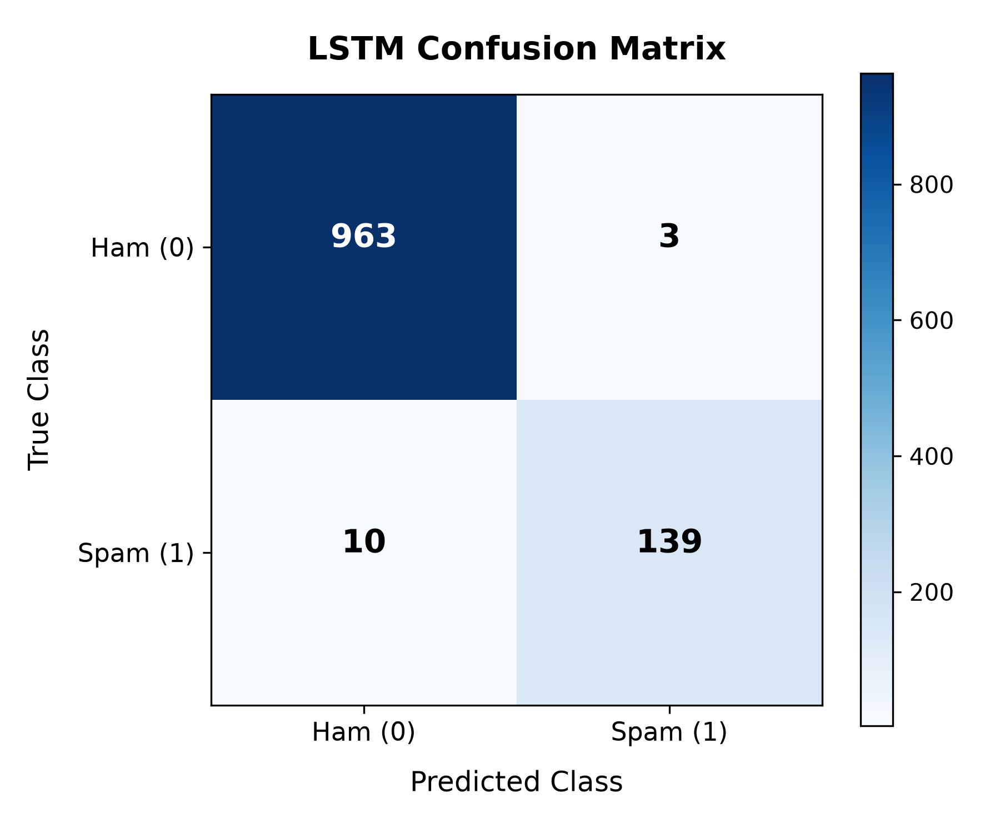

# Evaluation & Visualization Report: Intelligent SMS Spam Detection System

This report summarizes the performance evaluation and visualization of Deep Recurrent Neural Network architectures (Simple RNN and LSTM) for the Intelligent SMS Spam Detection project.

## 📊 Performance Comparison Summary

The models were evaluated on a test set (20% of the UCI SMS Spam dataset, consisting of **1,115 messages**). Both models were trained with sequence masking (`mask_zero=True`) to handle padded sequences properly.

| Model | Accuracy | Precision | Recall | F1-Score |
| :--- | :--- | :--- | :--- | :--- |
| **Simple RNN** | **98.92%** | **100.00%** | 91.95% | **95.80%** |
| **LSTM** | 98.83% | 97.89% | **93.29%** | 95.53% |

*Note: All metrics are rounded to 4 decimal places.*

---

## 📈 Visualizations

### 1. Simple RNN Model Plots

#### Training and Validation Performance Curves
Shows accuracy and loss progression over 5 training epochs.

#### Confusion Matrix
Visualizes correct predictions (diagonal cells) vs misclassifications.

---

### 2. LSTM Model Plots

#### Training and Validation Performance Curves
Shows accuracy and loss progression over 5 training epochs.

#### Confusion Matrix
Visualizes correct predictions (diagonal cells) vs misclassifications.

---

## 🔍 Key Findings and Analysis

1. **Overall Performance**:
   - Both models performed exceptionally well, achieving accuracies **above 98.8%** and F1-Scores **above 95.5%**, exceeding the initial target of 95%.
   - Recurrent architectures are highly effective at capturing sequential dependencies in short text messages.

2. **Precision vs. Recall Trade-off**:
   - **Simple RNN** achieved a **100.00% Precision** score, meaning it had **zero false positives** (no legitimate messages/ham were incorrectly flagged as spam). This is a critical quality for a spam filter, as filtering out an important legitimate message is highly disruptive.
   - **LSTM** achieved a higher **Recall of 93.29%** (compared to RNN's 91.95%), meaning it detected slightly more spam messages. However, it had a few false positives (resulting in a precision of 97.89%).

3. **Impact of Sequence Masking**:
   - Standard post-padded sequences often suffer from the "forgetting" effect in RNNs due to processing long blocks of padding zeros at the end of a message.
   - Initializing the models with `mask_zero=True` on the Keras Embedding layer prevented this behavior. This allowed both models to converge rapidly (in just 5 epochs) to near-optimal weights.

## 🏁 Conclusion

Both Simple RNN and LSTM models demonstrate excellent spam classification performance. For deployments where **zero false positives** is critical, the **Simple RNN** is preferred. If capturing **maximum spam** is desired and minor false positives are tolerable, the **LSTM** model is slightly better due to its higher recall.
